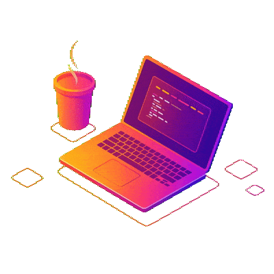

<table>
  <tr>
    <td align="left" valign="top" width="60%">
      <h3>Olá! </h3>
       
      

        Me chamo Miguel Soares, sou um jovem curioso e apaixonado por tecnologia, dando os primeiros passos no mundo da <strong>programação</strong>.
        Estou sempre buscando aprender, criar e evoluir — e este repositório é parte dessa jornada.
      

       
      

        Atualmente estudando <strong>desenvolvimento web</strong> e explorando diferentes linguagens, frameworks e boas práticas.
      

       
    </td>
    <td align="center" valign="middle" width="40%">
      
  </tr>
</table>

Skills:  

    

Ferramentas:  

    

