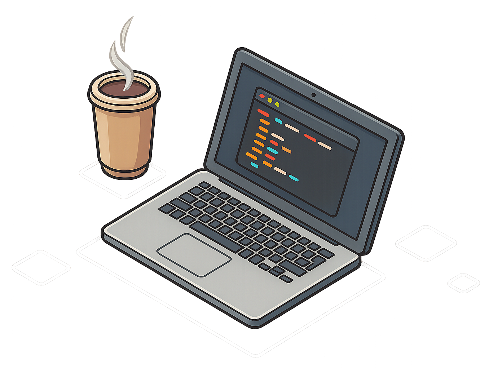

  
  

  ### Olá 
  

 

Me chamo Miguel Soares, sou um jovem curioso e apaixonado por tecnologia, dando os primeiros passos no mundo da **programação**. Estou sempre buscando aprender, criar e evoluir — e este repositório é parte dessa jornada.

 

Atualmente estudando **desenvolvimento web** e explorando diferentes linguagens, frameworks e boas práticas.

 

#

Skills:  

  
    
  

Ferramentas:  

    

<!--
**migueldevpe/migueldevpe** is a ✨ _special_ ✨ repository because its `README.md` (this file) appears on your GitHub profile.

Here are some ideas to get you started:

- 🔭 I’m currently working on ...
- 🌱 I’m currently learning ...
- 👯 I’m looking to collaborate on ...
- 🤔 I’m looking for help with ...
- 💬 Ask me about ...
- 📫 How to reach me: ...
- 😄 Pronouns: ...
- ⚡ Fun fact: ...
-->
